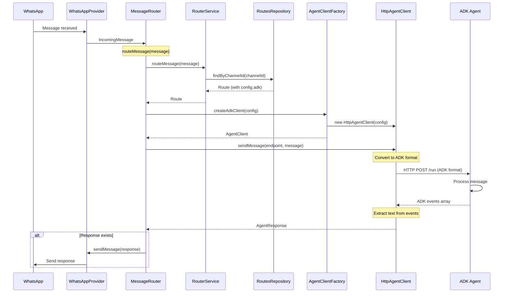

# wa2ai → Agent Contract Specification

> This document defines the contract between wa2ai router and AI agent endpoints. It explains what the contract is, why it exists, and how agents and wa2ai interact to process messages.

**Last Updated:** 2025-12-09  
**Version:** 2.0

---

## Table of Contents

1. [The Problem and Solution](#the-problem-and-solution)
2. [Architecture and Components](#architecture-and-components)
3. [How It Works: Message Flow](#how-it-works-message-flow)
4. [Request Format](#request-format)
5. [Response Format](#response-format)
6. [Error Handling](#error-handling)
7. [Implementation Details](#implementation-details)
8. [Configuration](#configuration)
9. [Testing](#testing)

---

## The Problem and Solution

### The Problem: Why We Need a Contract

Imagine you're building a system that connects WhatsApp messages to AI agents. You might think: "I'll just send the message directly to the agent, and it will respond." But here's the challenge:

**Different agents use different protocols.** One agent might use HTTP REST, another might use gRPC, and a third might use WebSockets. Each has its own request format, response format, and error handling.

**Without a standardized contract**, wa2ai would need:
- Custom code for each agent type
- Different error handling for each protocol
- Maintenance burden when agents change their APIs
- Difficulty adding new agent types

This violates fundamental software engineering principles: **separation of concerns** and **dependency inversion**. The routing logic shouldn't depend on specific agent implementations.

### The Solution: Agent Contract

The **Agent Contract** solves this by defining a standardized way for wa2ai to communicate with AI agents. Think of it as a "translator" that:
1. Converts wa2ai's internal message format to the agent's protocol
2. Handles the agent's response format
3. Manages errors and timeouts consistently

**Current Implementation:** wa2ai uses the **ADK (Agent Development Kit) API format**. This is a well-defined protocol that:
- Provides a standardized HTTP-based API
- Supports session management (important for conversation context)
- Handles state and artifacts (for complex agent interactions)
- Is the current standard in the project's agent ecosystem

**Future Flexibility:** The system is designed to support other protocols (gRPC, WebSocket, etc.) by implementing new `AgentClient` classes. The contract abstraction allows this without changing the routing logic.

**What This Contract Defines:**
- **Request format**: How wa2ai converts messages to agent protocol (currently ADK)
- **Response format**: How agents respond and how wa2ai processes those responses
- **Error handling**: Standardized error communication across all agent types
- **Timeout behavior**: How long wa2ai waits for agent responses

**Key Insight:** The contract is an **abstraction layer**. wa2ai's routing logic talks to the contract interface, not to specific agent implementations. This is the essence of Clean Architecture: business logic (routing) is independent of infrastructure (agent protocols).

---

## Architecture and Components

### Architecture Overview

Before diving into the contract details, let's understand **where the contract fits in the overall architecture**. This context is crucial for understanding why components are designed the way they are.

The agent contract is implemented within wa2ai's **Clean Architecture** structure. This architectural pattern separates concerns into layers:
- **Core layer**: Business logic and interfaces (no dependencies on external systems)
- **Infrastructure layer**: Concrete implementations (HTTP clients, databases, etc.)

**Why this matters:** The contract interface lives in the core layer, while the ADK implementation lives in the infrastructure layer. This means:
- The routing logic (core) doesn't know about ADK specifics
- We can swap ADK for gRPC without changing routing code
- The system is testable (we can mock the contract interface)

Understanding this architecture helps clarify how components interact and why the contract exists.

```
┌─────────────────────────────────────────────────────────────┐
│                    WhatsApp Provider                        │
│              (BaileysProvider / EvolutionProvider)          │
└───────────────────────┬─────────────────────────────────────┘
                        │
                        ▼
        ┌───────────────────────────────┐
        │      MessageRouter             │
        │   (Core Application Service)   │
        └───────────────┬───────────────┘
                        │
        ┌───────────────┴───────────────┐
        │                               │
        ▼                               ▼
┌───────────────┐              ┌──────────────────┐
│ RouterService │              │ AgentClientFactory│
│   (Core)      │              │    (Infra)        │
└───────────────┘              └────────┬─────────┘
                                        │
                                        ▼
                            ┌──────────────────────┐
                            │   HttpAgentClient    │
                            │      (Infra)         │
                            └──────────┬───────────┘
                                       │
                                       ▼
                            ┌──────────────────────┐
                            │   ADK Agent          │
                            │  (POST /run)         │
                            └──────────────────────┘
```

### Component Responsibilities

Understanding what each component does, why it exists, and how it works is essential for grasping the contract's role in the system. Let's examine each component systematically.

#### Core Layer (`router/src/core/`)

The core layer contains business logic and interfaces. It has **no dependencies** on external systems, making it testable and independent of infrastructure choices.

**AgentClient Interface** (`router/src/core/agent-client.ts`)
- **What it does**: Defines the contract (interface) that all agent clients must implement. This is the "contract" in "agent contract."
- **Why it exists**: Provides abstraction so wa2ai can work with different agent protocols (ADK, gRPC, WebSocket) without coupling routing logic to specific implementations. This is the **Dependency Inversion Principle** in action: high-level modules (routing) don't depend on low-level modules (HTTP clients); both depend on abstractions (the interface).
- **How it works**: 
  - Defines a single method: `sendMessage(agentEndpoint: string, message: IncomingMessage): Promise<AgentResponse>`
  - This method signature is the "contract" - any agent client must implement it
  - Concrete implementations (HttpAgentClient for ADK, future GrpcAgentClient for gRPC) implement this interface
  - MessageRouter uses the interface type, not concrete implementations, so it doesn't know or care about ADK, gRPC, etc.
  
**Key insight:** This interface is the "boundary" between wa2ai's routing logic and agent implementations. It's like a USB port: the computer (wa2ai) doesn't care if you plug in a mouse, keyboard, or flash drive - they all implement the USB interface.

**AgentClientFactory Interface** (`router/src/core/agent-client.ts`)
- **What it does**: Defines a factory interface for creating agent clients. A factory is a design pattern that encapsulates object creation.
- **Why it exists**: Allows creating agent clients with specific configurations without coupling the core layer to infrastructure implementations. Without the factory, MessageRouter would need to know how to construct HttpAgentClient (which requires infrastructure knowledge). The factory hides this complexity.
- **How it works**: 
  - Defines `createAdkClient(config: AdkClientConfig): AgentClient`
  - MessageRouter calls this method with configuration (app name, base URL, timeout)
  - Infrastructure layer implements this (HttpAgentClientFactory creates HttpAgentClient instances)
  - MessageRouter receives an `AgentClient` interface, not a concrete type
  - This allows MessageRouter to create clients dynamically based on route configuration
  
**Key insight:** The factory pattern here serves two purposes: (1) it hides the complexity of creating clients, and (2) it allows the core layer to create infrastructure objects without depending on infrastructure code directly.

**MessageRouter** (`router/src/core/message-router.ts`)
- **What it does**: Orchestrates the complete message routing flow from WhatsApp to agent and back. This is the "conductor" of the message processing orchestra.
- **Why it exists**: Coordinates all components (RouterService, AgentClient, WhatsAppProvider) to complete the message cycle. Without MessageRouter, each component would need to know about the others, creating tight coupling. MessageRouter provides a single point of coordination.
- **How it works** (step-by-step orchestration): 
  1. Receives `IncomingMessage` from WhatsApp provider (Baileys or Evolution API)
  2. Uses `RouterService` to find the route for the message's channel (which agent should handle this message?)
  3. Extracts ADK configuration from route (`config.adk` - app name, base URL, etc.)
  4. Uses `AgentClientFactory` to create an `AgentClient` instance (creates the "translator" for this specific agent)
  5. Sends message to agent via `AgentClient.sendMessage()` (the contract interface - doesn't know it's ADK)
  6. Receives `AgentResponse` from agent (standardized format, regardless of protocol)
  7. If response exists, sends it back to WhatsApp via `WhatsAppProvider.sendMessage()` (completes the cycle)
  8. Returns `MessageHandlerResult` indicating success or failure (for logging and error handling)
  
**Key insight:** MessageRouter is an **application service** - it orchestrates domain services (RouterService) and infrastructure (AgentClient, WhatsAppProvider) but doesn't contain business logic itself. It's the "glue" that connects everything together.

**RouterService** (`router/src/core/router-service.ts`)
- **What it does**: Finds the appropriate route for a message based on channel ID. This is pure business logic - "given a channel, which agent should handle it?"
- **Why it exists**: Separates route-finding logic from message routing orchestration. This follows the **Single Responsibility Principle**: MessageRouter orchestrates, RouterService finds routes. This makes the code more testable and maintainable.
- **How it works** (routing algorithm): 
  - Takes `IncomingMessage` with `channelId` (e.g., "1234567890")
  - Queries `RoutesRepository` to find route for `channelId` (looks in database)
  - If route found and has `regexFilter`, validates message text matches the pattern (e.g., only route messages starting with "Test")
  - If no specific route found or regex doesn't match, falls back to wildcard route (`"*"`) - a catch-all route
  - Returns `Route` (with agent endpoint and configuration) or `null` (no route found)
  
**Key insight:** RouterService is a **domain service** - it contains business logic (how to find routes) but doesn't know about HTTP, databases, or agents. It only knows about routes and messages.

**IncomingMessage Model** (`router/src/core/models.ts`)
- **What it does**: Represents a message received from WhatsApp
- **Why it exists**: Provides a domain model that's independent of WhatsApp provider specifics
- **Structure**:
  ```typescript
  {
    id: string                    // Unique message ID
    from: string                  // Sender (JID: "number@s.whatsapp.net")
    channelId: string             // Channel identifier (number without suffix)
    text: string                  // Message text content
    timestamp: Date               // When message was received
    metadata?: Record<string, unknown>  // Additional metadata
  }
  ```

**Route Model** (`router/src/core/models.ts`)
- **What it does**: Represents a routing rule that maps a channel to an agent endpoint
- **Why it exists**: Encapsulates routing configuration including agent-specific settings
- **Structure**:
  ```typescript
  {
    channelId: string            // Channel ID or "*" for wildcard
    agentEndpoint: string        // Agent endpoint URL
    environment: 'lab' | 'prod'  // Environment
    regexFilter?: string         // Optional regex filter
    config?: {                   // Agent-specific configuration
      adk?: {
        appName: string          // ADK agent name
        baseUrl?: string         // ADK server base URL
      }
    }
  }
  ```

**AgentResponse Model** (`router/src/core/agent-client.ts`)
- **What it does**: Represents the response from an agent
- **Why it exists**: Provides a standardized format for agent responses regardless of protocol
- **Structure**:
  ```typescript
  {
    success: boolean             // Whether processing succeeded
    response?: string            // Text response to send to user
    error?: string              // Error message if failed
    metadata?: Record<string, unknown>  // Additional metadata (e.g., ADK session info)
  }
  ```

#### Infrastructure Layer (`router/src/infra/`)

The infrastructure layer contains concrete implementations of interfaces defined in the core layer. These implementations know about HTTP, databases, file systems, etc.

**HttpAgentClient** (`router/src/infra/http-agent-client.ts`)
- **What it does**: Implements `AgentClient` interface for ADK HTTP API communication. This is the "translator" that converts between wa2ai's format and ADK's format.
- **Why it exists**: Encapsulates ADK protocol details (request/response format, HTTP communication) so MessageRouter doesn't need to know about ADK specifics. This is the **Adapter Pattern**: HttpAgentClient adapts the ADK protocol to the AgentClient interface.
- **How it works** (transformation process): 
  1. Receives `IncomingMessage` and `agentEndpoint` from MessageRouter (wa2ai's internal format)
  2. **Transforms to ADK format:**
     - Extracts `user_id` from `message.from` (removes `@s.whatsapp.net` suffix to get just the phone number)
     - Generates `session_id` as `{user_id}_{channelId}` (ensures same user+channel = same session for conversation context)
     - Builds ADK request body with `app_name` (from route config), `user_id`, `session_id`, `new_message` (from message.text)
  3. Sends HTTP POST to `{baseUrl}/run` endpoint (ADK's standard endpoint)
  4. Receives ADK events array response (ADK's format - array of Event objects)
  5. **Transforms back to wa2ai format:**
     - Filters events to find model responses (`author === 'model'` - only agent responses, not user messages)
     - Extracts text from last model event's `content.parts` (ADK can have multiple parts, we take the last one)
     - Builds `AgentResponse` with extracted text and metadata (session info, invocation ID, etc.)
  6. Returns `AgentResponse` to MessageRouter (wa2ai's standardized format)
  7. Handles errors (network failures, HTTP error status codes, timeouts) and converts to `AgentResponse` with `success: false` (standardized error format)
  
**Key insight:** HttpAgentClient is doing **protocol translation**. It knows about ADK's specific format, HTTP details, and error handling, but MessageRouter doesn't need to know any of this. This is the power of the contract abstraction.

**HttpAgentClientFactory** (`router/src/infra/agent-client-factory.ts`)
- **What it does**: Implements `AgentClientFactory` interface, creates `HttpAgentClient` instances. This is the concrete factory that knows how to build HTTP-based agent clients.
- **Why it exists**: Provides infrastructure implementation of the factory pattern, allowing MessageRouter to create agent clients without knowing concrete implementation details. MessageRouter says "create an ADK client with this config" and the factory handles the details of constructing HttpAgentClient.
- **How it works**: 
  - Receives `AdkClientConfig` from MessageRouter (app name, base URL, timeout)
  - Creates `HttpAgentClient` with appropriate configuration (wraps config in HttpAgentClientConfig format)
  - Returns `AgentClient` interface (not concrete type) - MessageRouter only sees the interface
  
**Key insight:** The factory pattern here allows MessageRouter to create infrastructure objects (HttpAgentClient) without directly depending on the infrastructure layer. The factory is the "bridge" between core and infrastructure.

**RoutesRepository** (`router/src/infra/postgres-routes-repository.ts`)
- **What it does**: Stores and retrieves routes from PostgreSQL database. This is the "memory" of the routing system.
- **Why it exists**: Provides persistence for routing rules so they survive container restarts. Without persistence, routes would be lost every time wa2ai restarts. This repository implements the `RoutesRepository` interface from core, so RouterService doesn't know it's using PostgreSQL - it could be MongoDB, Redis, or a file.
- **How it works**: 
  - Implements `RoutesRepository` interface from core (defines `findByChannelId`, `findAll`, `addRoute`, `removeRoute`)
  - Stores routes in PostgreSQL `routes` table (infrastructure detail)
  - RouterService queries this repository to find routes (uses the interface, not PostgreSQL-specific code)
  
**Key insight:** This is another example of the Dependency Inversion Principle. RouterService depends on the RoutesRepository interface (core), not on PostgreSQL (infrastructure). The PostgreSQL implementation is in the infrastructure layer.

### Component Interactions

Understanding how components interact is crucial for grasping the contract's role in the system. Let's trace through two key flows: initialization and message processing.

**Initialization Flow (System Startup):**

When wa2ai starts, components are created in a specific order to establish dependencies:

```
1. Application starts (index.ts)
   ↓
2. Creates RoutesRepository (PostgresRoutesRepository)
   - This is the "memory" - where routes are stored
   ↓
3. Creates RouterService with RoutesRepository
   - RouterService needs RoutesRepository to find routes
   - RouterService is a domain service (business logic)
   ↓
4. Creates AgentClientFactory (HttpAgentClientFactory)
   - This factory knows how to create agent clients
   - It's in infrastructure layer (knows about HTTP)
   ↓
5. Creates WhatsAppProvider (BaileysProvider or EvolutionProvider)
   - This handles WhatsApp communication
   - Also in infrastructure/providers layer
   ↓
6. Creates MessageRouter with RouterService, AgentClientFactory, WhatsAppProvider
   - MessageRouter orchestrates all these components
   - It receives dependencies via constructor (dependency injection)
   ↓
7. Registers message handlers (Baileys routing or webhook endpoints)
   - Connects WhatsApp input to MessageRouter
   - System is now ready to process messages
```

**Why this order matters:** Each component depends on the ones created before it. RouterService needs RoutesRepository, MessageRouter needs RouterService, etc. This is **dependency injection** - dependencies are provided from outside, making the system testable and flexible.

**Message Processing Flow (Runtime):**

When a message arrives, here's how components interact:

```
1. WhatsApp message arrives → WhatsAppProvider normalizes to IncomingMessage
   - Provider-specific format (Baileys/Evolution) → wa2ai's standard format
   ↓
2. IncomingMessage → MessageRouter.routeMessage()
   - MessageRouter is the entry point for routing
   ↓
3. MessageRouter → RouterService.routeMessage() → finds Route
   - RouterService queries RoutesRepository (database lookup)
   - Returns Route with agent configuration
   ↓
4. MessageRouter → AgentClientFactory.createAdkClient() → creates HttpAgentClient
   - Factory creates the "translator" for this specific agent
   - Returns AgentClient interface (MessageRouter doesn't know it's HTTP)
   ↓
5. MessageRouter → HttpAgentClient.sendMessage() → converts to ADK format, sends HTTP POST
   - HttpAgentClient transforms IncomingMessage → ADK format
   - Sends HTTP POST to agent's /run endpoint
   ↓
6. ADK Agent → processes message, returns ADK events array
   - Agent does its work (AI processing, etc.)
   - Returns response in ADK format
   ↓
7. HttpAgentClient → parses events, extracts text, returns AgentResponse
   - HttpAgentClient transforms ADK format → AgentResponse
   - This is the contract in action: protocol-specific → standardized
   ↓
8. MessageRouter → WhatsAppProvider.sendMessage() → sends response to WhatsApp
   - Completes the cycle: WhatsApp → Agent → WhatsApp
```

**Key Design Decisions and Their Rationale:**

1. **Interface-based design**: MessageRouter uses `AgentClient` interface, not `HttpAgentClient` directly
   - **Why**: This is the **Dependency Inversion Principle**. High-level modules (MessageRouter) don't depend on low-level modules (HttpAgentClient). Both depend on abstractions (AgentClient interface).
   - **Benefit**: Allows adding new agent protocols (gRPC, WebSocket) without changing MessageRouter. Just implement the interface.
   - **How**: New implementations (e.g., `GrpcAgentClient`) implement `AgentClient` interface. MessageRouter code doesn't change.

2. **Factory pattern**: MessageRouter uses `AgentClientFactory` to create clients
   - **Why**: **Separation of Concerns**. MessageRouter shouldn't know how to construct HttpAgentClient (that's infrastructure knowledge). The factory encapsulates this.
   - **Benefit**: Decouples client creation from client implementation. If we change how clients are created, only the factory changes.
   - **How**: Factory receives configuration, creates appropriate client type, returns interface.

3. **Configuration in routes**: ADK configuration stored in route `config.adk`
   - **Why**: **Flexibility**. Different routes can use different agents or configurations. A route for "support" might use one agent, while "sales" uses another.
   - **Benefit**: Allows dynamic routing based on channel, with different agents per channel.
   - **How**: Route model includes `config` field with agent-specific settings. MessageRouter reads this when creating clients.

4. **Clean Architecture layers**: Core defines interfaces, infra implements them
   - **Why**: **Independence**. Business logic (routing) should be independent of infrastructure (HTTP, databases). This makes the system testable, maintainable, and flexible.
   - **Benefit**: Can swap infrastructure (PostgreSQL → MongoDB, HTTP → gRPC) without changing business logic.
   - **How**: Core layer has no dependencies on infra layer. Infra depends on core (implements core interfaces). Dependencies point inward.

---

## How It Works: Message Flow

Understanding the complete flow helps clarify why each part of the contract exists and how all components work together.

### Complete Message Flow Diagram



### Detailed Step-by-Step Flow

**Step 1: Message Arrives from WhatsApp**
- WhatsApp provider (Baileys or Evolution API) receives message
- Provider normalizes message to `IncomingMessage` format
- Provider calls `MessageRouter.routeMessage(incomingMessage)`

**Step 2: MessageRouter Finds Route**
- `MessageRouter` calls `RouterService.routeMessage(message)`
- `RouterService` queries `RoutesRepository.findByChannelId(message.channelId)`
- `RoutesRepository` returns `Route` from database (or `null` if not found)
- If route has `regexFilter`, `RouterService` validates message text matches pattern
- If no specific route found, `RouterService` looks for wildcard route (`"*"`)
- `RouterService` returns `Route` to `MessageRouter`

**Step 3: MessageRouter Creates Agent Client**
- `MessageRouter` extracts ADK configuration from route: `route.config.adk`
- `MessageRouter` calls `AgentClientFactory.createAdkClient(config)`
- `AgentClientFactory` creates `HttpAgentClient` instance with configuration
- `AgentClientFactory` returns `AgentClient` interface to `MessageRouter`

**Step 4: HttpAgentClient Converts Message to ADK Format**
- `MessageRouter` calls `AgentClient.sendMessage(agentEndpoint, message)`
- `HttpAgentClient` receives `IncomingMessage` and `agentEndpoint`
- `HttpAgentClient` converts to ADK format:
  - Extracts `user_id`: removes `@s.whatsapp.net` from `message.from`
  - Generates `session_id`: `{user_id}_{channelId}`
  - Builds ADK request body with `app_name`, `user_id`, `session_id`, `new_message`

**Step 5: HttpAgentClient Sends HTTP POST to Agent**
- `HttpAgentClient` sends HTTP POST to `{baseUrl}/run`
- Request body contains ADK-formatted JSON
- Request includes timeout configuration (default: 30 seconds)

**Step 6: ADK Agent Processes Message**
- ADK agent receives POST request at `/run` endpoint
- Agent parses ADK request format
- Agent processes message using its logic
- Agent generates response events

**Step 7: ADK Agent Returns Events Array**
- Agent returns HTTP 200 with ADK events array in response body
- Events array contains Event objects with `author: "model"` for responses

**Step 8: HttpAgentClient Processes Response**
- `HttpAgentClient` receives HTTP response
- Parses JSON response as array of Event objects
- Filters events to find model responses (`author === 'model'`)
- Extracts text from last model event's `content.parts`
- Builds `AgentResponse` object:
  ```typescript
  {
    success: true,
    response: "extracted text",
    metadata: { adk: { sessionId, userId, eventCount, invocationId } }
  }
  ```
- Returns `AgentResponse` to `MessageRouter`

**Step 9: MessageRouter Sends Response to WhatsApp**
- `MessageRouter` receives `AgentResponse` from `HttpAgentClient`
- If `response.success === true` and `response.response` exists:
  - `MessageRouter` calls `WhatsAppProvider.sendMessage(outgoingMessage)`
  - `WhatsAppProvider` sends message back to WhatsApp
- `MessageRouter` returns `MessageHandlerResult` indicating success or failure

### Component Interactions in Detail

**MessageRouter ↔ RouterService**
- **Interaction**: `MessageRouter` delegates route finding to `RouterService`
- **Why**: Separates routing orchestration from route-finding logic
- **Data flow**: `IncomingMessage` → `Route` or `null`

**MessageRouter ↔ AgentClientFactory**
- **Interaction**: `MessageRouter` uses factory to create agent clients
- **Why**: Decouples client creation from client implementation
- **Data flow**: `AdkClientConfig` → `AgentClient` interface

**MessageRouter ↔ HttpAgentClient**
- **Interaction**: `MessageRouter` sends messages via `AgentClient` interface
- **Why**: Allows different agent protocols without changing MessageRouter
- **Data flow**: `IncomingMessage` + `agentEndpoint` → `AgentResponse`

**HttpAgentClient ↔ ADK Agent**
- **Interaction**: HTTP POST request/response using ADK API format
- **Why**: Standardized protocol for agent communication
- **Data flow**: ADK request JSON → ADK events array JSON

**MessageRouter ↔ WhatsAppProvider**
- **Interaction**: `MessageRouter` sends responses back via `WhatsAppProvider`
- **Why**: Abstracts WhatsApp communication details
- **Data flow**: `OutgoingMessage` → message sent to WhatsApp

---

## Request Format

### Overview

wa2ai sends incoming WhatsApp messages to ADK agents using HTTP POST requests to the `/run` endpoint. The request body follows the ADK API format.

### HTTP Method and Endpoint

**Method:** `POST`  
**Endpoint:** `{baseUrl}/run`

Where `baseUrl` is the ADK server base URL configured in the route (e.g., `http://localhost:8000`).

**Headers:**
```
Content-Type: application/json
```

### Request Body Structure

wa2ai converts an `IncomingMessage` into ADK format:

```json
{
  "app_name": "my_sample_agent",
  "user_id": "5493777239922",
  "session_id": "5493777239922_5493777239922",
  "new_message": {
    "parts": [
      {"text": "Hello, how can you help me?"}
    ]
  },
  "streaming": false,
  "state_delta": null,
  "invocation_id": null
}
```

### Field Descriptions

| Field | Type | Required | Description | Source in wa2ai |
|-------|------|----------|-------------|-----------------|
| `app_name` | `string` | Yes | ADK agent name (directory name) | From route `config.adk.appName` |
| `user_id` | `string` | Yes | User identifier | Extracted from `message.from`, sanitized (removes `@s.whatsapp.net`) |
| `session_id` | `string` | Yes | Session identifier | Generated as `{from}_{channelId}`, sanitized |
| `new_message` | `object` | Yes | Message content in ADK Content format | Created from `message.text` |
| `new_message.parts` | `array` | Yes | Array of message parts | Contains text part from `message.text` |
| `new_message.parts[].text` | `string` | Yes | Text content | From `message.text` |
| `streaming` | `boolean` | No | Always `false` (non-streaming mode) | Hardcoded |
| `state_delta` | `object\|null` | No | Always `null` | Hardcoded |
| `invocation_id` | `string\|null` | No | Always `null` | Hardcoded |

### How wa2ai Generates the Request

**Step 1: Extract user ID**
```typescript
// From: "5493777239922@s.whatsapp.net"
// To: "5493777239922"
const userId = message.from.replace('@s.whatsapp.net', '').replace('@g.us', '')
```

**Step 2: Generate session ID**
```typescript
// Format: {from}_{channelId}
// Example: "5493777239922_5493777239922"
const sessionId = `${userId}_${message.channelId}`
```

**Step 3: Build ADK request**
```typescript
const adkRequest = {
  app_name: route.config.adk.appName,
  user_id: userId,
  session_id: sessionId,
  new_message: {
    parts: [{ text: message.text }]
  },
  streaming: false,
  state_delta: null,
  invocation_id: null
}
```

### Example Request

```http
POST http://localhost:8000/run
Content-Type: application/json

{
  "app_name": "my_sample_agent",
  "user_id": "5493777239922",
  "session_id": "5493777239922_5493777239922",
  "new_message": {
    "parts": [
      {"text": "What's the weather today?"}
    ]
  },
  "streaming": false,
  "state_delta": null,
  "invocation_id": null
}
```

---

## Response Format

### Overview

ADK agents must respond with an array of Event objects. wa2ai processes this array to extract the agent's text response.

### Success Response Format

ADK agents respond with an array of Event objects:

```json
[
  {
    "content": {
      "parts": [
        {"text": "I can help you with that. The weather today is sunny, 25°C."}
      ],
      "role": "model"
    },
    "invocationId": "e-7e18f0f0-9616-4508-9780-ee812fb8ff57",
    "author": "model",
    "actions": {
      "stateDelta": {},
      "artifactDelta": {}
    }
  }
]
```

### How wa2ai Processes the Response

wa2ai's `HttpAgentClient` processes the ADK response in these steps:

**Step 1: Receive events array**
```typescript
const events: AdkEvent[] = await response.json()
```

**Step 2: Filter model events**
```typescript
// Only process events from the model (author === 'model')
const modelEvents = events.filter(event => event.author === 'model')
```

**Step 3: Extract text from last model event**
```typescript
if (modelEvents.length > 0) {
  const lastEvent = modelEvents[modelEvents.length - 1]
  const textParts = lastEvent.content.parts
    .filter(part => part.text)
    .map(part => part.text)
  const responseText = textParts.join('\n')
}
```

**Step 4: Convert to AgentResponse**
```typescript
const agentResponse: AgentResponse = {
  success: true,
  response: responseText, // "I can help you with that. The weather today is sunny, 25°C."
  metadata: {
    adk: {
      sessionId: sessionId,
      userId: userId,
      eventCount: events.length,
      invocationId: lastEvent.invocationId
    }
  }
}
```

**Important:** If no model events are found in the response array, wa2ai returns `success: true` but without a `response` field. This means no message will be sent back to the user (the agent processed the message but chose not to respond).

### Error Response

ADK agents indicate errors via HTTP status codes:

- **400 Bad Request**: Invalid request format
  - wa2ai will log the error and throw: `"ADK agent endpoint returned 400: {errorText}"`

- **404 Not Found**: Agent or session not found
  - wa2ai will log the error and throw: `"ADK agent endpoint returned 404: {errorText}"`

- **500 Internal Server Error**: Agent execution error
  - wa2ai will log the error and throw: `"ADK agent endpoint returned 500: {errorText}"`

**Note:** wa2ai does not process error responses from the response body. All errors are indicated via HTTP status codes. If the agent returns a non-200 status, wa2ai reads the response body (if available) for logging purposes but uses the status code to determine the error.

---

## Error Handling

### Network Errors

**What happens:** If the request fails due to network issues (connection refused, DNS error, timeout, etc.)

**How wa2ai handles it:**
1. Logs an error with the error message
2. Throws an error: `"Failed to send message to ADK agent: {errorMessage}"`
3. MessageRouter catches the error and returns `{ success: false, error: "..." }`

**Example:**
```typescript
// Network error: connection refused
try {
  await agentClient.sendMessage(endpoint, message)
} catch (error) {
  // Error: "Failed to send message to ADK agent: connect ECONNREFUSED 127.0.0.1:8000"
  logger.error('[HttpAgentClient] Network error', { error })
  throw error
}
```

### HTTP Error Status

**What happens:** If the ADK agent returns a non-200 HTTP status code

**How wa2ai handles it:**
1. Reads the response body (if available) for error details
2. Logs an error with the status code and error text
3. Throws an error: `"ADK agent endpoint returned {status}: {errorText}"`

**Example:**
```typescript
// Agent returns 404 Not Found
// Response body: { "error": "Agent 'my_agent' not found" }
// wa2ai throws: "ADK agent endpoint returned 404: Agent 'my_agent' not found"
```

### Timeout Errors

**What happens:** If the agent does not respond within the timeout period (default: 30 seconds)

**How wa2ai handles it:**
1. Aborts the HTTP request
2. Logs an error with `timeout: true`
3. Throws an error: `"Request to agent timed out after {timeout}ms"`

**Configuration:**
- Default timeout: 30 seconds (30000 ms)
- Can be configured via `AgentClientConfig.timeout` when creating the client

### Empty or Invalid Response

**What happens:** If the ADK agent returns `200 OK` but the response format is invalid

**Scenarios:**

1. **Response is not an array:**
   ```typescript
   // Agent returns: { "message": "Hello" }
   // wa2ai throws: "ADK agent response must be an array of events"
   ```

2. **Response array has no model events:**
   ```typescript
   // Agent returns: [{ "author": "user", ... }]
   // wa2ai returns: { success: true } (no response field, no message sent to user)
   ```

3. **Response array has model events:**
   ```typescript
   // Agent returns: [{ "author": "model", "content": { "parts": [{ "text": "Hello" }] } }]
   // wa2ai returns: { success: true, response: "Hello" }
   ```

---

## Implementation Details

### wa2ai Side

**Interface:** `AgentClient` (`router/src/core/agent-client.ts`)
- Defines the contract that all agent clients must implement
- Provides abstraction so wa2ai can work with different agent protocols

**Implementation:** `HttpAgentClient` (`router/src/infra/http-agent-client.ts`)
- Implements `AgentClient` interface for ADK HTTP API
- Handles ADK request/response format conversion
- Manages HTTP communication, timeouts, and error handling

**Usage in MessageRouter:**
```typescript
// MessageRouter creates HttpAgentClient via factory
const agentClient = agentClientFactory.createAdkClient({
  appName: route.config.adk.appName,
  baseUrl: route.config.adk.baseUrl || route.agentEndpoint,
  timeout: 30000
})

// Sends message to agent
const response = await agentClient.sendMessage(
  route.agentEndpoint,
  message
)

// If response exists, sends it back to WhatsApp
if (response.success && response.response) {
  await whatsappProvider.sendMessage({
    to: message.from,
    channelId: message.channelId,
    text: response.response
  })
}
```

### Agent Side

Agents must implement the ADK API format as specified in `refs/adk_api.md`:

1. **Endpoint**: `POST /run`
2. **Request format**: ADK request body (see [Request Format](#request-format))
3. **Response format**: Array of Event objects (see [Response Format](#response-format))
4. **Error handling**: HTTP status codes (400, 404, 500)

**Example ADK Agent Implementation:**
See `tests/fixtures/adk-mock-agent.js` for a complete reference implementation that demonstrates:
- Receiving ADK requests
- Processing messages
- Generating ADK event responses
- Error handling

---

## Configuration

### Route Configuration

All routes **must** include ADK configuration in the `config` field:

```json
{
  "channelId": "5493777239922",
  "agentEndpoint": "http://localhost:8000",
  "environment": "lab",
  "config": {
    "adk": {
      "appName": "my_sample_agent",
      "baseUrl": "http://localhost:8000"
    }
  }
}
```

**Configuration Fields:**
- `appName` (required): ADK agent name (directory name, not constructor name)
  - This must match the agent's directory name in the ADK server
- `baseUrl` (optional): Base URL of ADK server
  - If not provided, uses `agentEndpoint` from the route
  - Should include protocol and port (e.g., `http://localhost:8000`)

### Session ID Strategy

**How session IDs are generated:**
- Format: `{from}_{channelId}` (sanitized)
- Example:
  - `from`: `5493777239922@s.whatsapp.net`
  - `channelId`: `5493777239922`
  - `session_id`: `5493777239922_5493777239922`

**Why this format:**
- Each user has a unique session per channel
- Sessions persist across messages (same user, same channel = same session)
- Group conversations use combined identifiers
- Allows agents to maintain conversation context

### Complete Usage Example

**1. Create route with ADK configuration:**
```bash
curl -X POST http://localhost:3000/api/routes \
  -H "Content-Type: application/json" \
  -d '{
    "channelId": "5493777239922",
    "agentEndpoint": "http://localhost:8000",
    "environment": "lab",
    "config": {
      "adk": {
        "appName": "my_sample_agent",
        "baseUrl": "http://localhost:8000"
      }
    }
  }'
```

**2. Send message via WhatsApp:**
- User sends "Hello" from WhatsApp
- wa2ai receives message and finds route
- MessageRouter creates HttpAgentClient
- HttpAgentClient converts message to ADK format and sends to `POST http://localhost:8000/run`
- Agent processes message and returns ADK events array
- HttpAgentClient extracts text from events
- MessageRouter sends response back to WhatsApp

**3. Verify ADK communication:**
Check logs for ADK-specific entries:
```
[HttpAgentClient] Sending ADK message to http://localhost:8000/run
[HttpAgentClient] ADK response received: 1 events
[HttpAgentClient] ADK response processed: extracted text from model event
[HttpAgentClient] ADK message sent successfully
```

---

## Testing

### ADK Mock Agent

wa2ai includes an ADK mock agent for testing (`tests/fixtures/adk-mock-agent.js`):

```bash
node tests/fixtures/adk-mock-agent.js 8000 test_agent
```

**What the mock agent does:**
- Listens on port 8000 (configurable)
- Implements ADK API format (`POST /run` endpoint)
- Returns ADK events array format
- Implements a safety limit (max 3 messages) to prevent infinite loops in tests
- Supports `GET /list-apps` endpoint for listing available agents

**Why it exists:** Provides a reference implementation and testing tool for verifying wa2ai's ADK integration.

### Unit Tests

wa2ai includes comprehensive unit tests for `HttpAgentClient`:
- `tests/unit/agent-client.test.ts`

These tests verify:
- ADK request format conversion
- ADK response parsing
- Error handling
- Timeout behavior

### Integration Tests

Integration tests verify the complete flow:
- `tests/integration/message-sending.test.ts` - Tests message sending with ADK agents
- `tests/integration/direct-routing.test.ts` - Tests complete routing flow with ADK agents

---

## References

- **ADK API Specification**: `refs/adk_api.md` - Complete ADK API reference
- **wa2ai AgentClient Interface**: `router/src/core/agent-client.ts` - Interface definition
- **wa2ai HttpAgentClient Implementation**: `router/src/infra/http-agent-client.ts` - ADK implementation
- **wa2ai Domain Models**: `router/src/core/models.ts` - IncomingMessage, OutgoingMessage, Route
- **ADK Mock Agent**: `tests/fixtures/adk-mock-agent.js` - Reference implementation

---

## Future Extensions

The system is designed to support multiple agent protocols:

- **Current**: ADK HTTP API (implemented via `HttpAgentClient`)
- **Future possibilities**: 
  - gRPC agent clients
  - WebSocket agent clients
  - Other agent protocol implementations

**How to add a new protocol:**

1. **Define the interface** (if needed): Extend `AgentClient` interface in `router/src/core/agent-client.ts`
2. **Implement the client**: Create new client class in `router/src/infra/` (e.g., `GrpcAgentClient.ts`)
3. **Update AgentClientFactory**: Add factory method to create the new client type
4. **Update route config**: Add configuration options for the new protocol
5. **Update MessageRouter**: Handle new protocol selection based on route config

**Example structure:**
```typescript
// router/src/infra/grpc-agent-client.ts
export class GrpcAgentClient implements AgentClient {
  async sendMessage(endpoint: string, message: IncomingMessage): Promise<AgentResponse> {
    // gRPC implementation
  }
}
```

---

## Version History

- **v2.0** (2025-12-09): Updated to use ADK API format (current implementation)
  - Changed from generic format to ADK-specific format
  - Added session ID generation strategy
  - Added ADK configuration requirements
  - Improved error handling documentation

- **v1.0** (2025-12-09): Initial contract specification (deprecated - used generic format)
